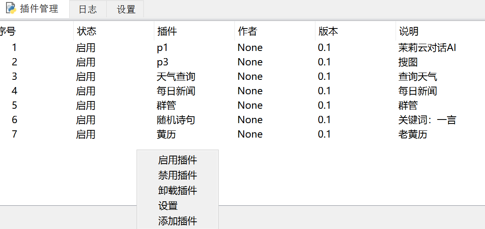

# 开始
*请确保你下载了任何支持反向websocket通讯方式且实现了OneBot协议的后端,没有建议版本*
*本框架的依赖项是PyQt5,websocket,websocket-client*
# 配置
更改./data/config.ini中的main[ws_addr]项，也可以在框架启动后在设置里更改，然后重启框架
### 示例：
```python
ws_addr = ws://192.168.1.104:6700
```
## 使用
*运行start.py即可。*
##### 注意，必须手动打开后端框架,再打开本框架.

# 安装插件
在插件管理tab里右键，选择添加插件，接着选中你的插件，插件就添加成功了。
*最后不用忘了启用插件*


# 插件开发
在提供的模板中修改响应函数，参照注释的提示。
```python
def init(p_id: int, Api: object, ):  # 框架启动调用
    global gp_id
    global qqbot
    gp_id = p_id
    qqbot = Api
    return {'name': name, 'complain': '简短的解释', 'author': '作者', 'ver': '0.1', 'p_id': p_id,
            'respond_group_msg': True, 'respond_private_msg': False, 'respond_notice': False, 'respond_request': False}


```
*p_id不要改*

*setting函数负责反应插件设置，在里面定义插件的设置界面。*

**respond_group_msg是是否响应群消息，如果你的插件要相应群消息，请将其设为True**，其他同。

```python
def setting():
    tk = tkinter.Tk()
    tk.geometry('300x200')
    tk.title('天气查询')
    tkinter.Label(tk, text='test').pack()
    e = tkinter.Entry(tk)
    e.pack()
    b = tkinter.Button(text='确定')
    b.pack()
    tk.mainloop()
```

**插件必须要有的函数：init，close，enable，disable，setting**

**你可以直接在函数里写pass，但不能没有，否则插件安装将会不成功**

**init除外，init必须按照模板写**

插件开发完成后把插件和依赖项放在一个文件夹里，再用*打包软件.py*打包，直接运行，先输入插件名，再点击添加代码库选中*刚才的文件夹*，最后打包\

